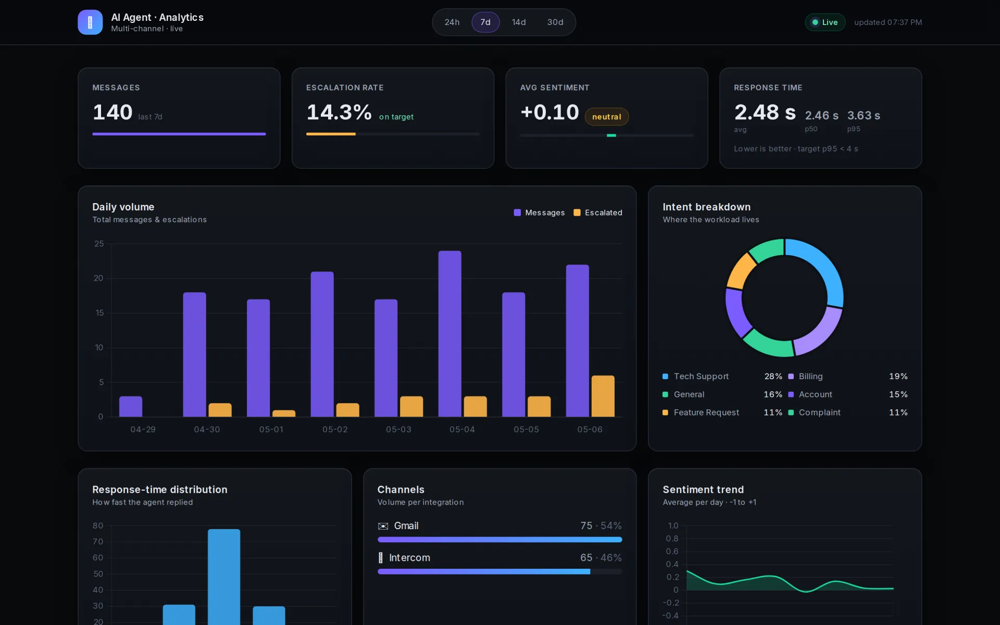

# AI Customer Conversation Agent

> **Multi-channel autonomous agent** that reads, classifies, remembers, and replies to customer messages across Gmail and Intercom — with vector memory, RAG-powered knowledge base, sentiment-driven escalation, and a live analytics dashboard.

Built on the Gmail API, Intercom REST API, and Google Gemini, this is a production-style implementation of an LLM agent that goes beyond a simple "reply bot": it classifies intent, scores sentiment, retrieves grounding from a markdown knowledge base, persists long-term memory in a vector store, and escalates to humans when the conversation needs it.

<p align="center">
  
  <br>
  <sub>Live analytics dashboard: message volume, escalation rate, sentiment trend, and intent breakdown.</sub>
</p>

---

## Highlights

| Capability | What it does |
|---|---|
| **Multi-channel** | Single agent core, pluggable channel adapters (Gmail, Intercom, easy to extend) |
| **Intent Classification** | Routes every message into `sales`, `support`, `billing`, `feedback`, `vip_escalation`, `spam` |
| **Sentiment Analysis** | LLM polarity score + keyword urgency detection for escalation triggers |
| **Vector Memory (RAG)** | ChromaDB-backed semantic recall across all past conversations |
| **Knowledge Base** | Markdown FAQ files retrieved via TF-IDF and injected into the prompt |
| **Auto-Escalation** | Negative sentiment or VIP intent triggers a Slack alert with full context |
| **Analytics Dashboard** | FastAPI dashboard with intent mix, sentiment trends, escalation rate, response time |
| **Modular Architecture** | Clean separation of agents, channels, memory, tools, analytics |

---

## Architecture

```
                        +-------------------+
                        |  Channel Adapters |
                        |  Gmail | Intercom |
                        +---------+---------+
                                  |
                                  v
+-------------+         +-------------------+         +------------------+
|  Knowledge  |<------> |    Orchestrator   |<------> |  Vector Memory   |
|  Base (MD)  |  RAG    |                   |  recall |  (ChromaDB)      |
+-------------+         +---------+---------+         +------------------+
                                  |
                  +---------------+---------------+
                  |               |               |
                  v               v               v
          +---------------+ +-----------+ +----------------+
          | Intent        | | Sentiment | | Short-term     |
          | Classifier    | | Analyzer  | | Memory (SQLite)|
          +---------------+ +-----------+ +----------------+
                                  |
                                  v
                        +-------------------+
                        | Slack Escalation  |
                        | + Metrics Store   |
                        +-------------------+
```

---

## Project Structure

```
.
├── agents/
│   ├── orchestrator.py        # main coordinator
│   ├── intent_classifier.py   # zero-shot intent routing
│   └── sentiment_analyzer.py  # polarity + urgency detection
├── channels/
│   ├── base.py                # abstract ChannelAdapter
│   ├── gmail_channel.py       # Gmail API integration
│   └── intercom_channel.py    # Intercom REST integration
├── memory/
│   ├── short_term.py          # SQLite rolling window
│   └── vector_store.py        # ChromaDB semantic memory
├── tools/
│   ├── knowledge_retriever.py # markdown KB + TF-IDF retrieval
│   └── escalation.py          # Slack notification service
├── analytics/
│   ├── metrics.py             # event aggregation
│   └── dashboard.py           # FastAPI dashboard
├── knowledge_base/            # markdown FAQ files
│   ├── billing.md
│   ├── sales.md
│   └── support.md
├── config/settings.py         # pydantic-settings env loader
├── tests/                     # pytest smoke tests
├── main.py                    # entry point
├── docker-compose.yml         # agent + dashboard
└── requirements.txt
```

---

## Quick Start

### 1. Clone and install

```bash
git clone https://github.com/mmeekh/Email-Automation-with-AI.git
cd Email-Automation-with-AI
pip install -r requirements.txt
```

### 2. Configure

```bash
cp .env.example .env
# fill in GEMINI_API_KEY, optionally INTERCOM_ACCESS_TOKEN and SLACK_ESCALATION_WEBHOOK
```

Place your Gmail OAuth credentials in `credentials.json` (download from [Google Cloud Console](https://console.cloud.google.com/) → Gmail API → OAuth 2.0).

### 3. Run

```bash
python main.py
```

On first run a browser window opens for Gmail OAuth. Subsequent runs use the cached `token.json`.

### 4. Run the dashboard (separate terminal)

```bash
uvicorn analytics.dashboard:app --reload
```

Open [http://localhost:8000](http://localhost:8000) for the live dashboard.

### Or use Docker

```bash
docker compose up -d
```

Spins up both the agent and the dashboard. Logs:

```bash
docker compose logs -f agent
```

---

## Channels

### Gmail
Polls every 30 seconds for unread emails newer than 30 minutes. Filters out newsletters, no-reply addresses, and known platforms (LinkedIn, GitHub, Binance, etc.).

### Intercom
Polls open conversations marked unread. Replies as the configured admin. Supports auto-assignment to human admins on escalation.

### Adding your own
Implement the `ChannelAdapter` interface in [`channels/base.py`](channels/base.py) (just three methods: `fetch_unread`, `reply`, `mark_read`) and register it in `main.py`. Slack DM, Zendesk, Crisp, and HubSpot adapters fit the same shape.

---

## Memory Model

The agent uses a **two-tier memory system**:

- **Short-term** (SQLite): rolling window of the last 10 messages per thread, used as immediate chat context.
- **Long-term** (ChromaDB): every exchange is embedded and stored permanently. The orchestrator retrieves the top-K semantically similar past messages on every new incoming message — enabling cross-thread learning ("a customer asked something similar last month").

---

## Knowledge Base (RAG)

Drop any markdown file in `knowledge_base/` and it becomes searchable. The retriever splits documents on `##` headings, tokenizes, and ranks by query overlap. The top-3 relevant chunks are injected into the system prompt before generation.

Three starter files are included: `billing.md`, `sales.md`, `support.md`.

---

## Escalation Logic

The orchestrator hands off to a human when **any** of these are true:

- Sentiment polarity below -0.4 (frustrated/angry tone)
- Urgency keywords match `critical` (lawsuit, lawyer, press) or `high` (urgent, outage, broken)
- Intent classifier returns `vip_escalation` (enterprise, partnership, press, legal)

When triggered, the agent sends the customer a holding reply, posts the full context (intent, sentiment, message excerpt, reasoning) to Slack, and exits the auto-reply path.

---

## Analytics Dashboard

The FastAPI dashboard at `/` shows for the last 7 days:

- Total messages handled per channel
- Escalation rate
- Average sentiment polarity
- Average response time
- Intent distribution table

JSON API endpoints available at `/api/summary` and `/api/events` for integration with external BI tools.

---

## Tech Stack

| Layer | Tech |
|---|---|
| LLM | Google Gemini 2.5 Flash Lite |
| Channels | Gmail API, Intercom REST API |
| Vector DB | ChromaDB (HNSW, cosine similarity) |
| Storage | SQLite (short-term + metrics) |
| Web | FastAPI + Uvicorn |
| Config | pydantic-settings |
| Container | Docker + Docker Compose |
| Tests | pytest |

---

## Roadmap

- [ ] Slack channel adapter (DMs + threads)
- [ ] Zendesk channel adapter
- [ ] Self-improving knowledge base (auto-extract FAQs from resolved tickets)
- [ ] Tool-use agent loop (calendar booking, refund processing, ticket creation)
- [ ] A/B testing framework for system prompts
- [ ] Multi-tenant deployment (per-customer personas and KBs)

---

## Tests

```bash
pytest -q
```

---

Built by [Muhammet Emin Kilic](https://linkedin.com/in/emin-kilic-250b14210)
